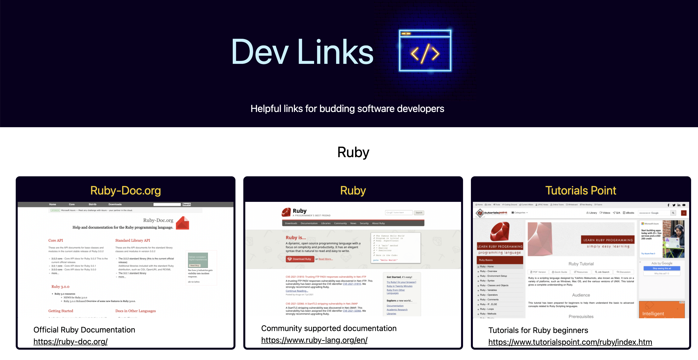
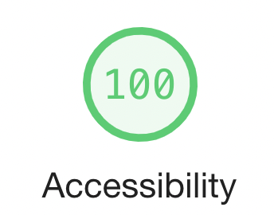

# Dev Links #

**DevLinks** is a single page React app of helpful links for budding software developers.

The app is available at:

<https://developerlinks.netlify.app/>

## Styling ##

The favicon/header image was purchased through [VectorStock.com](https://www.vectorstock.com/).  

The colour scheme was generated through [Coolors.co](https://coolors.co/) using the header image as the basis for selecting the theme colours used throughout the app.

Tailwind CSS has been used for styling.

## General ##

This project was bootstrapped with [Create React App](https://github.com/facebook/create-react-app) using the basic template.

## Deployment ##

The **DevLinks** app has been deployed through [Netlify](https://www.netlify.com/).

## Testing ##

Unit tests were written using the Jest testing framework. To run the tests, in the command line, enter

`yarn test`

Integration tests were written using the Cypress testing framework. To run the tests, in the command line, enter

`yarn run cypress open`

## Navigation ##

React Router DOM has been used to create the effect of multiple pages within the app, with each language or framework given a dedicated page for ease of navigation.

## Accessibility ##

Chrome DevTools Lighthouse report showed a score of 100% for user accessibility.

<!-- ## Download and Installation Instructions ## -->
